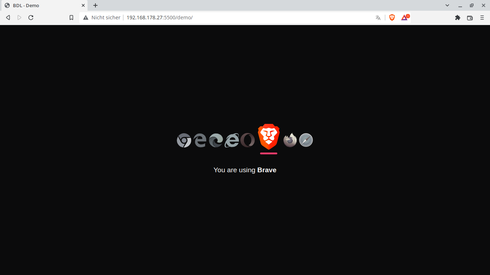

# Gallery
Here you can find screenshots of every supported browser.

<table>
<tbody>
<tr>
<td>
<figure class="image">

<figcaption>Brave</figcaption>
</figure>
</td>
<td>
<figure class="image">

<figcaption>Chromium</figcaption>
</figure>
</td>
</tr>
<tr>
<td>
<figure class="image">

<figcaption>Microsoft Edge</figcaption>
</figure>
</td>
<td>
<figure class="image">

<figcaption>FireFox</figcaption>
</figure>
</td>
</tr>
<tr>
<td>
<figure class="image">

<figcaption>IE 11</figcaption>
</figure>
</td>
<td>
<figure class="image">

<figcaption>Opera</figcaption>
</figure>
</td>
</tr>
<tr>
<td>
<figure class="image">

<figcaption>Safari</figcaption>
</figure>
</td>
<td></td>
</tr>
</tbody>
</table>